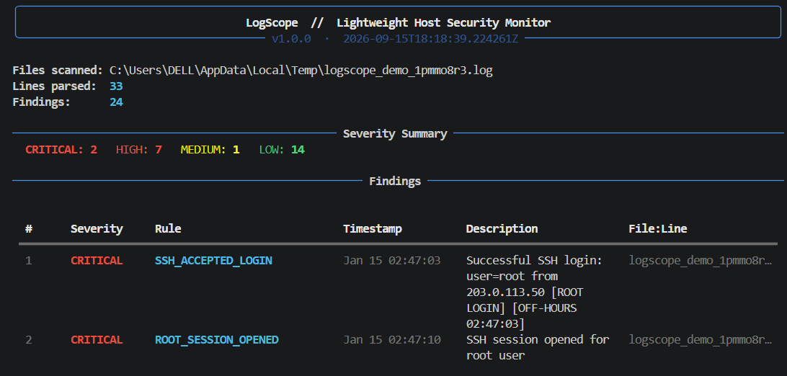

# LogScope

> **Beta release** — LogScope is now in a more capable beta stage, but features may still evolve, APIs may change, and bugs may remain. Contributions and feedback are welcome.

**Lightweight host security monitor for local log monitoring.** 
Parses local authentication and system logs, detects suspicious patterns, and outputs a threat report in your terminal or as JSON. It is designed for one host, with no agents, no cloud, and no dependencies beyond an optional `rich` install.
---

---

## Features

- **Brute force SSH detection** — flags repeated failed login attempts from a single IP
- **Root login alerts** — catches successful SSH logins and session opens as root
- **Off-hours login flagging** — highlights logins outside configured business hours
- **New user creation detection** — monitors `useradd`/`adduser` events
- **Port scan detection** — infers scans from firewall DROP/REJECT log patterns
- **Severity scoring** — every finding is rated `LOW` · `MEDIUM` · `HIGH` · `CRITICAL`
- ️ **Rich terminal output** — coloured, tabulated report via `rich` (falls back to plain text)
- **JSON export** — machine-readable output for piping into other tools

---

## Requirements

- Python 3.10+
- Linux system with standard log files (`/var/log/auth.log`, `/var/log/syslog`, etc.) or a Windows machine with accessible event/log files
- [`rich`](https://github.com/Textualize/rich) *(optional, for coloured terminal output)*

```bash
pip install rich
```

---

## Installation

```bash
git clone https://github.com/blissio/logscope.git
cd logscope
```

No build step required — it's a single script.

---

## Usage

```bash
# Scan default system logs (requires read access)
sudo python3 logscope.py

# Scan specific log files
sudo python3 logscope.py --logs /var/log/auth.log /var/log/syslog

# Try it instantly with built-in synthetic demo data
python3 logscope.py --demo

# Export a JSON report to file
sudo python3 logscope.py --format json --output report.json

# Print JSON to stdout
sudo python3 logscope.py --format json

# Load settings from a config file
python3 logscope.py --config logscope.toml

# Skip findings from specific IPs or users
python3 logscope.py --config logscope.toml

# Only show HIGH and above
sudo python3 logscope.py --severity HIGH

# Adjust brute-force threshold (default: 5 attempts)
sudo python3 logscope.py --brute-threshold 3

# Watch log files continuously
python3 logscope.py --watch --watch-interval 2

# Export an HTML report
python3 logscope.py --format html --output report.html
```

Example config file:

```toml
[logscope]
logs = ["/var/log/auth.log", "/var/log/syslog"]
brute_threshold = 3
severity = "HIGH"
format = "json"
output = "report.json"
allowlist = ["10.0.0.5"]
ignorelist = ["root"]
```

---

## CLI Reference

| Flag | Default | Description |
|---|---|---|
| `--logs FILE [FILE ...]` | Standard Linux paths | Log files to parse |
| `--format` | `rich` / `plain` | Output format: `rich`, `plain`, or `json` |
| `--output FILE` | stdout | Write JSON report to file |
| `--severity` | *(all)* | Minimum severity filter: `LOW` `MEDIUM` `HIGH` `CRITICAL` |
| `--brute-threshold N` | `5` | Failed SSH attempts before brute-force alert |
| `--demo` | — | Run against built-in synthetic demo log |
| `--config FILE` | `./logscope.toml` | Load settings from a config file |
| `--watch` | — | Continuously poll log files for new activity |
| `--watch-interval SECONDS` | `2.0` | Polling interval for watch mode |
| `--format` | `rich` / `plain` | Output format: `rich`, `plain`, `json`, or `html` |
| `--version` | — | Print version and exit |

---

## Detection Rules

| Rule | Trigger | Severity |
|---|---|---|
| `SSH_BRUTE_FORCE` | ≥ N failed logins from one IP | HIGH / CRITICAL |
| `SSH_FAILED_LOGIN` | Single failed login attempt | LOW |
| `SSH_ACCEPTED_LOGIN` | Successful login (root or off-hours escalates) | LOW → CRITICAL |
| `SSH_MAX_AUTH_EXCEEDED` | SSH max auth attempts error | HIGH |
| `ROOT_SESSION_OPENED` | PAM session opened for root | CRITICAL |
| `SU_TO_ROOT` | `su` to root (off-hours escalates) | HIGH / CRITICAL |
| `SUDO_COMMAND` | sudo usage (dangerous commands escalate) | LOW / HIGH |
| `NEW_USER_CREATED` | `useradd` / `adduser` detected | HIGH |
| `PORT_SCAN_DETECTED` | ≥ 10 firewall DROPs from one source IP | HIGH / CRITICAL |
| `AUTH_FAILURE` | Generic PAM authentication failure | LOW |
| `CRON_ROOT_CMD` | Cron job executed as root (off-hours escalates) | LOW / MEDIUM |

---

## Log Files Parsed (defaults)

```
/var/log/auth.log ← Debian/Ubuntu SSH, sudo, su, PAM
/var/log/syslog ← General system events
/var/log/kern.log ← Kernel/firewall (UFW, iptables)
/var/log/secure ← RHEL/CentOS auth equivalent
/var/log/messages ← RHEL/CentOS syslog equivalent
```

Files that don't exist or aren't readable are silently skipped.

---

## Exit Codes

| Code | Meaning |
|---|---|
| `0` | No findings |
| `1` | One or more findings detected |

---

## Roadmap (WIP)

Things planned or in progress — not yet implemented:

- [x] Config file support (`logscope.toml`)
- [x] Allowlist/ignorelist for IPs and users
- [x] Watch mode (`--watch`) for real-time log tailing
- [x] Basic Windows-style log parsing support
- [x] HTML report output
- [ ] Journald (`journalctl`) support
- [ ] Email/webhook alerting
- [x] Rate limiting / deduplication for noisy rules
- [x] Core unit test coverage
- [ ] Time-window correlation and bounded long-running state
- [ ] Journald (`journalctl`) adapter
- [ ] Native Windows Event Log adapter
- [ ] Email/webhook alerting

---

## Known Limitations

- Timestamp parsing assumes standard syslog format — non-standard log formats may be partially parsed or missed
- Detection state currently lives in memory for the lifetime of a monitor process; threshold correlation is not yet time-windowed
- Port scan detection is heuristic (DROP count per source IP); sophisticated scans spread across many IPs will not be caught
- No support for compressed/rotated logs (`.gz`, `.1`, etc.) yet
- Requires direct file read access — does not parse `journald` binary logs
- Windows support is currently best-effort and uses a small set of platform-aware default paths rather than full Event Log integration
- LogScope is not a centralized SIEM: it does not collect from multiple hosts or provide a shared dashboard and investigation workflow

---

## License

MIT
